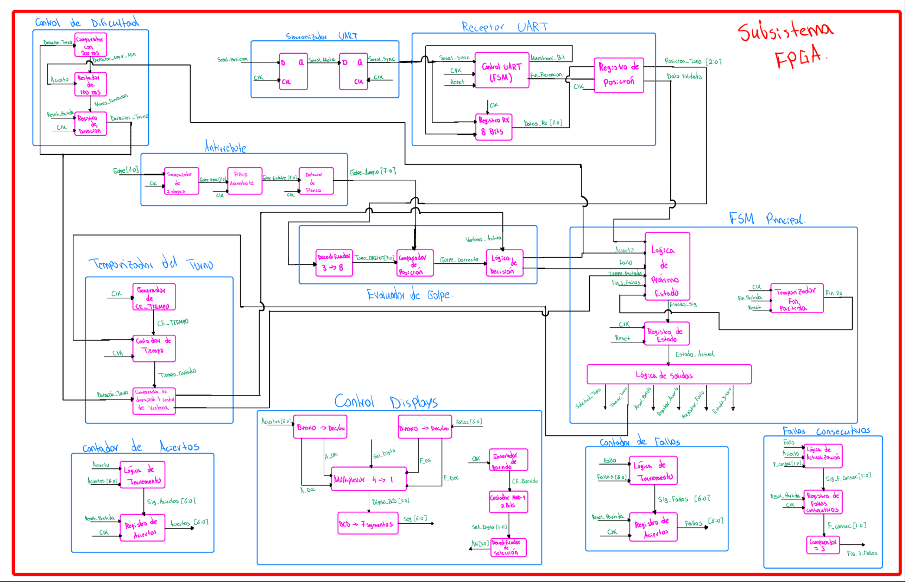
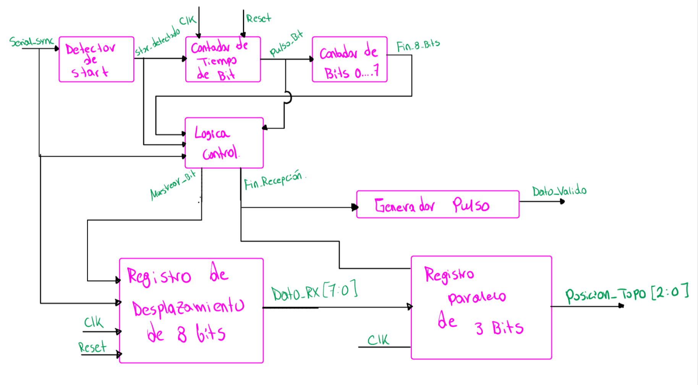
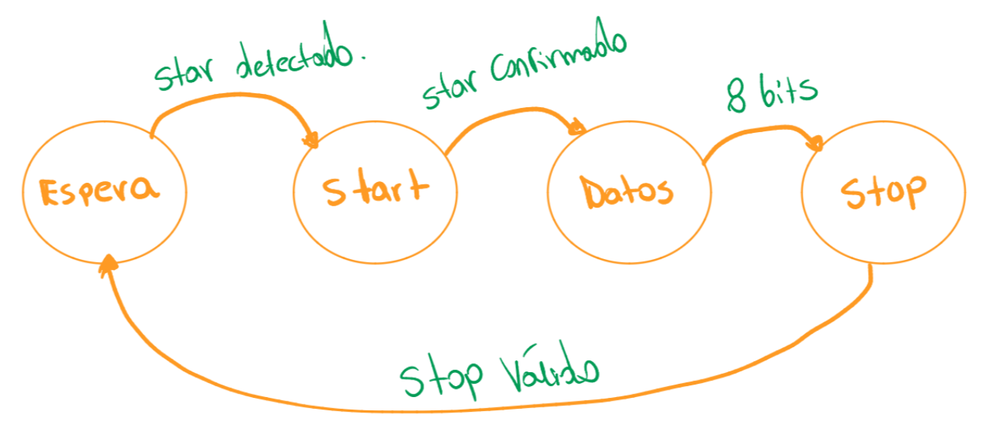

# Diseño inicial — Proyecto 1

## 1. Introducción

Este documento presenta el diseño inicial del sistema **Whack-a-Mole**, desarrollado para el Proyecto 1 del curso EL3313.

El diseño se realiza siguiendo una metodología modular y jerárquica, en la cual el sistema se descompone progresivamente en subsistemas y bloques de menor nivel. De esta manera, se parte de una representación general de las entradas y salidas del sistema y posteriormente se detallan las funciones y componentes internos necesarios para su implementación.

En las siguientes secciones se presentan los diagramas correspondientes a los diferentes niveles de diseño.

---

# 2. Diagrama de primer nivel

## 2.1 Descripción general

El diagrama de primer nivel representa el sistema **Whack-a-Mole** completo como un único bloque funcional. En este nivel se identifican únicamente las entradas y salidas externas del sistema, sin mostrar su estructura interna.

El sistema dispone de ocho pulsadores que permiten al jugador interactuar con las ocho posibles posiciones del topo. Durante cada turno, una de estas posiciones se activa y se indica visualmente mediante uno de los ocho LEDs.

El jugador debe presionar el pulsador correspondiente a la posición activa dentro del tiempo disponible. A partir de esta acción, el sistema determina el resultado del turno y actualiza los aciertos y fallos acumulados, los cuales se muestran mediante los cuatro displays de 7 segmentos.

El sistema utiliza además un reloj de 100 MHz como referencia temporal para la lógica implementada en la FPGA y una señal de reinicio para regresar el juego a sus condiciones iniciales.

---

## 2.2 Entradas

Las entradas externas identificadas en el diagrama de primer nivel son:

| Señal | Descripción |
|---|---|
| `Reloj 100 MHz` | Señal de reloj principal utilizada como referencia temporal por la lógica implementada en la FPGA. |
| `8 pulsadores` | Pulsadores utilizados por el jugador para seleccionar una de las ocho posiciones posibles del topo. |
| `Reinicio` | Señal utilizada para reiniciar el juego y restablecer sus condiciones iniciales. |

---

## 2.3 Salidas

Las salidas externas del sistema son:

| Señal | Descripción |
|---|---|
| `8 LEDs` | Indican visualmente cuál de las ocho posiciones del topo se encuentra activa durante el turno. |
| `7 segmentos` | Señales asociadas a los cuatro displays de 7 segmentos utilizados para mostrar los aciertos y fallos acumulados. |

---

## 2.4 Diagrama de primer nivel

El diagrama de primer nivel del sistema se presenta a continuación:


---

## 2.5 Descripción del funcionamiento

El funcionamiento general del sistema comienza con la selección de una de las ocho posiciones posibles del topo. La posición activa se representa visualmente mediante uno de los ocho LEDs.

El jugador responde utilizando el pulsador asociado a la posición que considera activa. El sistema procesa esta acción y determina si corresponde a un acierto o un fallo.

Después de evaluar el resultado, se actualizan los contadores correspondientes y se inicia un nuevo turno. Los aciertos y fallos acumulados durante la partida se muestran simultáneamente mediante los cuatro displays de 7 segmentos.

La señal de reloj de 100 MHz proporciona la referencia temporal necesaria para el funcionamiento de la lógica implementada en la FPGA, mientras que la entrada de reinicio permite devolver el sistema a su estado inicial.

En este nivel no se especifica cómo se realizan internamente estas funciones, ya que dicha descomposición se desarrolla en los diagramas de niveles posteriores.

---

# 3. Diagrama de segundo nivel

## 3.1 Descripción general

El diagrama de segundo nivel divide el sistema completo en dos subsistemas principales: el **Subsistema Discreto** y el **Subsistema FPGA**. Ambos trabajan de manera conjunta para implementar el funcionamiento del juego.

El **Subsistema Discreto** se encarga de generar la posición pseudoaleatoria del topo, indicar visualmente la posición seleccionada mediante uno de los ocho LEDs y transmitir dicha posición hacia la FPGA mediante comunicación UART.

El **Subsistema FPGA** funciona como el controlador principal del juego. Este recibe la posición generada por el circuito discreto, procesa las entradas de los ocho pulsadores, determina el resultado de cada turno, controla su duración y dificultad, mantiene los contadores de aciertos y fallos y presenta los resultados mediante los cuatro displays de 7 segmentos.

La comunicación entre ambos subsistemas es bidireccional. La FPGA genera una señal de **solicitud de topo** para indicar cuándo se requiere una nueva posición, mientras que el subsistema discreto responde transmitiendo la posición generada mediante UART.

---

## 3.2 Subsistemas principales

### 3.2.1 Subsistema Discreto

**Función:**

El Subsistema Discreto tiene como función generar una nueva posición pseudoaleatoria cuando la FPGA lo solicita. La posición seleccionada se representa mediante uno de los ocho LEDs y, simultáneamente, se prepara para ser transmitida hacia la FPGA mediante comunicación UART.

Internamente, este subsistema está formado por los siguientes bloques principales:

- **Control de solicitud:** detecta y procesa la solicitud proveniente de la FPGA.
- **LFSR pseudoaleatorio:** genera la nueva posición del topo.
- **Decodificador 3 a 8:** convierte la posición de 3 bits en una señal de ocho líneas para activar únicamente el LED correspondiente.
- **Preparación del byte UART:** construye el byte que contiene la posición que será transmitida.
- **Registro/Transmisión UART:** realiza la transmisión serial de la información hacia la FPGA.
- **Generador de referencia temporal:** proporciona la temporización necesaria para realizar la transmisión UART.

**Entradas:**

| Señal | Descripción |
|---|---|
| `SOLICITUD_TOPO` | Señal proveniente de la FPGA que indica cuándo debe generarse una nueva posición del topo. |

**Salidas:**

| Señal | Descripción |
|---|---|
| `UART_TX` | Señal serial mediante la cual se transmite hacia la FPGA el byte que contiene la posición generada. |
| `LED[7:0]` | Ocho señales utilizadas para indicar visualmente cuál de las ocho posiciones del topo se encuentra activa. |

---

### 3.2.2 Subsistema FPGA

**Función:**

El Subsistema FPGA se encarga de controlar el funcionamiento general del juego. Recibe la posición generada por el Subsistema Discreto, procesa las acciones realizadas por el jugador y coordina la secuencia de cada turno.

Además, administra la duración de la ventana de respuesta, modifica progresivamente la dificultad, registra los aciertos y fallos y controla la visualización de los resultados.

Internamente, este subsistema está formado por los siguientes bloques principales:

- **Sincronizador UART:** sincroniza la señal serial recibida con el dominio de reloj de la FPGA.
- **UART RX:** recibe y reconstruye la información transmitida mediante UART.
- **Registro de posición:** almacena la posición del topo recibida.
- **FSM del juego:** coordina la secuencia general de funcionamiento del sistema.
- **Temporizador del turno:** controla el tiempo disponible para responder.
- **Control de dificultad:** determina la duración de los turnos conforme avanza la partida.
- **Contadores del juego:** mantienen los valores de aciertos, fallos y las condiciones necesarias para determinar el final de la partida.
- **Control de 7 segmentos:** permite visualizar los aciertos y fallos acumulados.

**Entradas:**

| Señal | Descripción |
|---|---|
| `UART_RX` | Señal serial proveniente del Subsistema Discreto que contiene la posición generada. |
| `BOTONES[7:0]` | Ocho pulsadores utilizados por el jugador para seleccionar la posición que desea golpear. |
| `CLK_100MHz` | Reloj principal utilizado por la lógica implementada en la FPGA. |
| `RESET` | Señal utilizada para reiniciar el sistema y devolverlo a sus condiciones iniciales. |

**Salidas:**

| Señal | Descripción |
|---|---|
| `SOLICITUD_TOPO` | Señal enviada al Subsistema Discreto para solicitar la generación y transmisión de una nueva posición. |
| `SEG[6:0]` | Señales utilizadas para controlar los segmentos de los displays de 7 segmentos. |
| `AN[3:0]` | Señales utilizadas para seleccionar los cuatro displays durante su multiplexación. |

---

## 3.3 Diagrama de segundo nivel

El diagrama de segundo nivel del sistema se presenta a continuación:


El diagrama muestra la división del diseño en los dos subsistemas principales y el flujo de información entre sus bloques internos.

En el Subsistema Discreto, una solicitud proveniente de la FPGA inicia la generación de una nueva posición. El valor producido por el LFSR se utiliza tanto para seleccionar uno de los ocho LEDs como para preparar el byte que será transmitido mediante UART.

En el Subsistema FPGA, la información recibida pasa inicialmente por la etapa de sincronización y recepción UART. La posición obtenida es almacenada y utilizada posteriormente por la FSM del juego para coordinar el desarrollo de cada turno.

La FSM interactúa con el temporizador, el control de dificultad y los contadores del juego para determinar la duración del turno, procesar las acciones del jugador y actualizar los resultados.

---

## 3.4 Comunicación entre subsistemas

La comunicación entre el Subsistema Discreto y el Subsistema FPGA se realiza mediante dos señales principales:

```text
                   SOLICITUD_TOPO
      FPGA ─────────────────────────► DISCRETO

                     UART
      FPGA ◄───────────────────────── DISCRETO
```

No es necesario compartir una señal de reloj entre ambos subsistemas, ya que cada uno trabaja con su propia referencia temporal.

### Solicitud de una nueva posición

Cuando la FPGA necesita comenzar un nuevo turno, la FSM del juego genera:

```text
SOLICITUD_TOPO
```

Esta señal es enviada al Subsistema Discreto y procesada por el bloque de Control de solicitud.

Como respuesta, el LFSR genera una nueva posición pseudoaleatoria. Esta posición se utiliza para activar el LED correspondiente y para preparar el byte que será enviado a la FPGA.

### Transmisión de la posición

Una vez obtenida la posición, el Subsistema Discreto realiza la transmisión mediante la línea:

```text
UART_TX
```

Esta señal se conecta con la entrada:

```text
UART_RX
```

del Subsistema FPGA.

La comunicación utiliza una trama UART **8N1**, formada por:

- 1 bit de inicio (`START`).
- 8 bits de datos.
- Sin bit de paridad.
- 1 bit de parada (`STOP`).

Dentro del byte transmitido, los tres bits menos significativos contienen la posición del topo:

```text
DATO[2:0] = POSICION_TOPO[2:0]
```

Estos tres bits permiten representar las ocho posiciones posibles:

| Valor binario | Posición |
|---|---:|
| `000` | 0 |
| `001` | 1 |
| `010` | 2 |
| `011` | 3 |
| `100` | 4 |
| `101` | 5 |
| `110` | 6 |
| `111` | 7 |

Una vez recibida la posición, la FPGA puede iniciar el turno correspondiente y evaluar la acción realizada por el jugador.

Por lo tanto, la secuencia general de comunicación entre ambos subsistemas es:

```text
FPGA
 │
 │ SOLICITUD_TOPO
 ▼
SUBSISTEMA DISCRETO
 │
 ├──► Genera posición pseudoaleatoria
 │
 ├──► Activa LED correspondiente
 │
 └──► Transmite posición por UART
              │
              ▼
             FPGA
              │
              ├──► Recibe posición
              ├──► Inicia turno
              ├──► Evalúa al jugador
              └──► Solicita siguiente posición
```

Esta organización permite mantener separadas las funciones de **generación de la posición**, implementadas mediante lógica discreta, y las funciones de **control del juego**, implementadas en la FPGA.

---

# 4. Diagrama de tercer nivel

## 4.1 Descripción general

En el tercer nivel de diseño se realiza la descomposición interna de los subsistemas definidos en el diagrama de segundo nivel. El objetivo de este nivel es identificar los bloques funcionales principales necesarios para implementar el comportamiento del sistema y establecer las señales mediante las cuales estos bloques se comunican.

Para el presente proyecto, el subsistema implementado en la FPGA se divide en bloques encargados de la recepción de la posición del topo, acondicionamiento de los pulsadores, evaluación del golpe, temporización del turno, control de dificultad, conteo de resultados, visualización y control general de la secuencia del juego.

## 4.2 Subsistema Discreto

#### 4.2.1 Bloque Oscilador Astable 555
**Función:** Generar una señal de reloj continua y autónoma que sirve como base de tiempos para todo el subsistema discreto.

**Entradas:**
| Señal | Descripción |
| :--- | :--- |
| `VCC` / `GND` | Alimentación del circuito (implícita). |

**Salidas:**
| Señal | Descripción |
| :--- | :--- |
| `reloj_alta_frec` | Señal de reloj base generada por el oscilador. |

#### 4.2.2 Bloque Divisor de Frecuencia
**Función:** Reducir la frecuencia de la señal base para obtener los relojes de operación requeridos por la lógica síncrona y la transmisión serial.

**Entradas:**
| Señal | Descripción |
| :--- | :--- |
| `reloj_alta_frec` | Señal de reloj rápida proveniente del oscilador. |

**Salidas:**
| Señal | Descripción |
| :--- | :--- |
| `Reloj_baud` | Reloj ajustado a la tasa de baudios para la transmisión UART. |
| `Clk_local` | Reloj de trabajo para los componentes síncronos del subsistema discreto. |

#### 4.2.3 Bloque Sincronizador de 2 etapas
**Función:** Mitigar la metastabilidad de la señal de solicitud asíncrona proveniente de la FPGA al ingresarla al dominio de reloj local.

**Entradas:**
| Señal | Descripción |
| :--- | :--- |
| `Solicitud_topo` | Señal externa de petición generada por la FPGA (GPIO). |
| `Clk_local` | Reloj local del subsistema discreto. |

**Salidas:**
| Señal | Descripción |
| :--- | :--- |
| `solicitud_sync` | Señal de solicitud alineada de forma segura con el reloj local. |

#### 4.2.4 Bloque Detector de Flanco de subida
**Función:** Convertir la señal de solicitud sincronizada en un único pulso de un ciclo de reloj para activar las cargas y avances del sistema sin generar repeticiones erróneas.

**Entradas:**
| Señal | Descripción |
| :--- | :--- |
| `solicitud_sync` | Señal de petición sincronizada. |
| `Clk_local` | Reloj local del subsistema discreto. |

**Salidas:**
| Señal | Descripción |
| :--- | :--- |
| `Pulso_avance (carga)` | Pulso de control de un ciclo de duración que acciona el LFSR y la UART. |

#### 4.2.5 Bloque Registro LFSR
**Función:** Generar el estado pseudoaleatorio que determina la secuencia de aparición de los topos.

**Entradas:**
| Señal | Descripción |
| :--- | :--- |
| `Pulso_avance (carga)` | Pulso que ordena avanzar al siguiente estado pseudoaleatorio. |
| `Clk_local` | Reloj local del subsistema discreto. |

**Salidas:**
| Señal | Descripción |
| :--- | :--- |
| `Estado_LFSR [3:0]` | Bus de 4 bits con el estado pseudoaleatorio actual del registro. |

#### 4.2.6 Bloque Extractor de Posición
**Función:** Adaptar y recortar el estado completo del LFSR a los bits estrictamente necesarios para representar las 8 posiciones posibles del juego.

**Entradas:**
| Señal | Descripción |
| :--- | :--- |
| `Estado_LFSR [3:0]` | Estado actual del LFSR de 4 bits. |

**Salidas:**
| Señal | Descripción |
| :--- | :--- |
| `Posición_topo [2:0]` | Bus de 3 bits con la posición activa válida para el decodificador y la UART. |

#### 4.2.7 Bloque Registro Trama (START+Datos+Stop)
**Función:** Empaquetar estáticamente los 3 bits de posición junto con los bits fijos de inicio (START), parada (STOP) y relleno para formar la estructura de una trama UART de 10 bits.

**Entradas:**
| Señal | Descripción |
| :--- | :--- |
| `Posición_topo [2:0]` | Bits con la información de la posición activa. |

**Salidas:**
| Señal | Descripción |
| :--- | :--- |
| `Trama_Paralelo [9:0]` | Bus de 10 bits con la trama completa armada en paralelo. |

#### 4.2.8 Bloque Contador de bits
**Función:** Llevar el registro de cuántos bits han sido transmitidos para habilitar o deshabilitar el desplazamiento del registro serializador.

**Entradas:**
| Señal | Descripción |
| :--- | :--- |
| `Pulso_avance (carga)` | Señal que reinicia el contador al iniciar una nueva transmisión. |
| `Reloj_baud` | Reloj de la tasa de transmisión. |

**Salidas:**
| Señal | Descripción |
| :--- | :--- |
| `Cuenta_bits [3:0]` | Estado actual del conteo de bits transmitidos. |
| `Habilita_shift` | Señal de control que permite el desplazamiento en el registro serial. |

#### 4.2.9 Bloque Registro Paralelo-Serie
**Función:** Recibir la trama armada en paralelo y desplazarla bit a bit de manera serial hacia la FPGA a la velocidad dictada por el reloj de baudios.

**Entradas:**
| Señal | Descripción |
| :--- | :--- |
| `Trama_Paralelo [9:0]` | La trama de 10 bits lista para enviar. |
| `Pulso_avance (carga)` | Pulso que indica cargar la trama en los registros. |
| `Reloj_baud` | Reloj que dicta el ritmo de desplazamiento de los datos. |
| `Habilita_shift` | Permiso del contador para realizar el desplazamiento. |

**Salidas:**
| Señal | Descripción |
| :--- | :--- |
| `Tx_serial` | Línea de datos serie que viaja hacia el subsistema FPGA. |

#### 4.2.10 Bloque Decodificador 3->8
**Función:** Traducir los 3 bits de posición en una única línea activa para encender físicamente el LED correspondiente al topo en el protoboard.

**Entradas:**
| Señal | Descripción |
| :--- | :--- |
| `Posición_topo [2:0]` | Bus con la posición activa del topo. |

**Salidas:**
| Señal | Descripción |
| :--- | :--- |
| `LEDs_topo [7:0]` | Bus de 8 líneas donde solo una está activa para encender el LED físico. |


## 4.3 Subsistema de la FPGA

El subsistema FPGA constituye la unidad de control principal del juego. Su función es recibir la posición generada por el subsistema discreto, procesar las entradas provenientes de los pulsadores, determinar si la acción del jugador corresponde a un acierto o un fallo, controlar la duración de los turnos, actualizar los contadores y coordinar el desarrollo completo de la partida.

El diagrama de tercer nivel del subsistema FPGA se muestra a continuación:



**Figura 4.1.** Diagrama de tercer nivel del subsistema FPGA.

Los bloques funcionales que conforman este subsistema se describen en las siguientes secciones.

---

### 4.3.1 Receptor UART

**Función:**

El receptor UART se encarga de recibir la información serial enviada desde el subsistema discreto y recuperar la posición del topo.

La comunicación utiliza una trama UART. El receptor procesa los bits recibidos y obtiene el byte de datos correspondiente. De este byte se utilizan los tres bits menos significativos para representar la posición del topo, permitiendo codificar las ocho posiciones posibles mediante valores entre `000` y `111`.

Además de entregar la posición recibida, el bloque genera una señal `DATO_VALIDO` para indicar al resto del sistema que se ha recibido correctamente una nueva posición y que esta se encuentra disponible para ser utilizada.

**Entradas:**

| Señal | Descripción |
|---|---|
| `SERIAL_SYNC` | Señal serial proveniente del subsistema discreto, previamente sincronizada con el dominio de reloj de la FPGA. |
| `CLK_100MHz` | Reloj principal utilizado para sincronizar el funcionamiento del receptor. |
| `RESET` | Reinicia el receptor UART y lo devuelve a su condición inicial. |

**Salidas:**

| Señal | Descripción |
|---|---|
| `POSICION_TOPO[2:0]` | Posición recibida del topo, codificada mediante 3 bits para representar una de las ocho posiciones posibles. |
| `DATO_VALIDO` | Pulso que indica que una nueva posición fue recibida correctamente y se encuentra disponible. |

**Diseño del bloque:**

El receptor se diseñó de manera modular. Internamente se consideran funciones de control de la recepción UART, almacenamiento de los ocho bits recibidos y almacenamiento de la posición final. Esta estructura será desarrollada con mayor detalle en el diagrama de cuarto nivel.

---

### 4.3.2 Sincronización y antirrebote

**Función:**

Este bloque acondiciona las señales provenientes de los ocho pulsadores utilizados por el jugador.

Los pulsadores constituyen señales externas y asíncronas respecto al reloj de la FPGA. Por esta razón, primero deben sincronizarse con `CLK_100MHz`. Adicionalmente, debido al comportamiento mecánico de los pulsadores, una única pulsación puede producir varias transiciones eléctricas en un intervalo corto de tiempo. El circuito de antirrebote evita que estas transiciones sean interpretadas como múltiples golpes.

Como resultado, el bloque entrega señales limpias y sincronizadas que representan una única pulsación válida por cada acción física realizada por el jugador.

**Entradas:**

| Señal | Descripción |
|---|---|
| `GOLPE[7:0]` | Señales provenientes de los ocho pulsadores físicos. |
| `CLK_100MHz` | Reloj principal utilizado para sincronizar y procesar las entradas. |
| `RESET` | Reinicia los elementos internos de sincronización y antirrebote. |

**Salidas:**

| Señal | Descripción |
|---|---|
| `GOLPE_LIMPIO[7:0]` | Señales acondicionadas de los ocho pulsadores, sincronizadas y libres de rebote. |

**Diseño del bloque:**

El acondicionamiento se realiza mediante una etapa de sincronización seguida por una etapa de antirrebote y detección de pulsación. De esta manera, los demás bloques trabajan únicamente con eventos digitales confiables.

---

### 4.3.3 Evaluador de golpe

**Función:**

El evaluador de golpe determina si el pulsador presionado por el jugador corresponde a la posición actual del topo.

Para realizar esta función, el bloque recibe `POSICION_TOPO[2:0]`, las señales acondicionadas de los pulsadores y la indicación de que la ventana temporal del turno se encuentra activa.

Si el jugador presiona el pulsador correspondiente a la posición del topo dentro del tiempo permitido, se genera un `ACIERTO`. Si se presiona una posición incorrecta durante la ventana válida, se genera un `FALLO`.

**Entradas:**

| Señal | Descripción |
|---|---|
| `POSICION_TOPO[2:0]` | Posición actual del topo recibida mediante UART. |
| `GOLPE_LIMPIO[7:0]` | Señales acondicionadas provenientes de los ocho pulsadores. |
| `VENTANA_ACTIVA` | Indica que el turno se encuentra dentro del tiempo permitido para responder. |

**Salidas:**

| Señal | Descripción |
|---|---|
| `ACIERTO` | Pulso generado cuando el jugador presiona el pulsador correcto dentro de la ventana temporal. |
| `FALLO` | Pulso generado cuando el jugador presiona un pulsador incorrecto dentro de la ventana temporal. |

**Diseño del bloque:**

El bloque realiza una comparación entre la posición codificada del topo y el pulsador activado. La evaluación solamente se considera válida mientras `VENTANA_ACTIVA` se encuentre activa.

---

### 4.3.4 Temporizador del turno

**Función:**

El temporizador del turno controla el intervalo durante el cual el jugador puede responder después de que se presenta una nueva posición del topo.

Al recibir `INICIAR_TURNO`, el temporizador comienza un nuevo conteo. Mientras el tiempo transcurrido sea menor que `DURACION_TURNO`, mantiene activa la señal `VENTANA_ACTIVA`.

Si el jugador no realiza una acción válida antes de que finalice este intervalo, el bloque genera `TIEMPO_AGOTADO`, condición que posteriormente es procesada por el controlador principal como un fallo del turno.

**Entradas:**

| Señal | Descripción |
|---|---|
| `CLK_100MHz` | Reloj principal del sistema. |
| `INICIAR_TURNO` | Orden proveniente de la FSM principal para iniciar una nueva ventana temporal. |
| `DURACION_TURNO` | Valor que determina la duración actual de la ventana del turno. |

**Salidas:**

| Señal | Descripción |
|---|---|
| `VENTANA_ACTIVA` | Indica que el jugador todavía se encuentra dentro del tiempo permitido para responder. |
| `TIEMPO_AGOTADO` | Pulso generado cuando se alcanza la duración máxima del turno sin una respuesta válida. |

**Diseño del bloque:**

El temporizador utiliza el reloj principal junto con una habilitación temporal o *clock enable*. De esta forma se obtiene una base de tiempo apropiada sin generar un reloj independiente. Un contador mide el tiempo transcurrido y un comparador determina cuándo se alcanza `DURACION_TURNO`.

---

### 4.3.5 Control de dificultad

**Función:**

El control de dificultad modifica progresivamente la duración disponible para responder conforme el jugador obtiene aciertos.

Al iniciar una nueva partida, la duración del turno se establece en `1,5 s`. Cada vez que se registra un acierto, esta duración se reduce en `100 ms`. La reducción continúa hasta alcanzar un valor mínimo de `500 ms`.

Los fallos no aumentan nuevamente la duración del turno.

**Entradas:**

| Señal | Descripción |
|---|---|
| `REGISTRAR_ACIERTO` | Indica que debe procesarse un nuevo acierto y reducirse la duración cuando corresponda. |
| `RESET_PARTIDA` | Restablece la duración inicial de `1,5 s`. |
| `CLK_100MHz` | Reloj utilizado para actualizar el registro de duración. |

**Salidas:**

| Señal | Descripción |
|---|---|
| `DURACION_TURNO` | Duración actual de la ventana temporal utilizada por el temporizador del turno. |

**Diseño del bloque:**

El bloque mantiene un registro con la duración actual. Ante cada acierto se comprueba si la duración puede reducirse y, en caso afirmativo, se restan `100 ms`. La duración se limita inferiormente a `500 ms`.

---

### 4.3.6 Contador de aciertos

**Función:**

Este bloque almacena la cantidad total de aciertos obtenidos durante la partida.

El contador se incrementa cada vez que la FSM principal genera `REGISTRAR_ACIERTO`. El resultado se limita al intervalo entre `0` y `99`, debido a que posteriormente se representa utilizando dos dígitos de los displays de 7 segmentos.

**Entradas:**

| Señal | Descripción |
|---|---|
| `REGISTRAR_ACIERTO` | Orden de incremento del contador. |
| `RESET_PARTIDA` | Reinicia el contador a cero al comenzar una nueva partida. |
| `CLK_100MHz` | Reloj principal utilizado para actualizar el contador. |

**Salidas:**

| Señal | Descripción |
|---|---|
| `ACIERTOS[6:0]` | Cantidad acumulada de aciertos, representada en binario entre 0 y 99. |

---

### 4.3.7 Contador de fallos acumulados

**Función:**

Este bloque lleva el conteo total de fallos ocurridos durante una partida.

El contador se incrementa cuando la FSM principal genera `REGISTRAR_FALLO`. Este evento puede producirse debido a una pulsación incorrecta o porque se agotó el tiempo disponible sin realizar una respuesta válida.

El valor acumulado se conserva aunque posteriormente ocurra un acierto y solamente se reinicia cuando comienza una nueva partida.

**Entradas:**

| Señal | Descripción |
|---|---|
| `REGISTRAR_FALLO` | Orden para incrementar el número total de fallos. |
| `RESET_PARTIDA` | Reinicia el contador a cero. |
| `CLK_100MHz` | Reloj utilizado para actualizar el contador. |

**Salidas:**

| Señal | Descripción |
|---|---|
| `FALLOS[6:0]` | Número acumulado de fallos de la partida, limitado al intervalo de 0 a 99. |

---

### 4.3.8 Contador de fallos consecutivos

**Función:**

Este bloque determina cuántos fallos consecutivos ha cometido el jugador.

A diferencia del contador de fallos acumulados, este contador vuelve a cero cuando se registra un acierto. Cuando se alcanzan tres fallos consecutivos, se genera la señal `FIN_3_FALLOS`, utilizada por la FSM principal para finalizar la partida.

**Entradas:**

| Señal | Descripción |
|---|---|
| `REGISTRAR_FALLO` | Incrementa el número de fallos consecutivos. |
| `REGISTRAR_ACIERTO` | Reinicia el contador de fallos consecutivos a cero. |
| `RESET_PARTIDA` | Inicializa el contador al comenzar una nueva partida. |
| `CLK_100MHz` | Reloj utilizado para actualizar el contador. |

**Salidas:**

| Señal | Descripción |
|---|---|
| `FIN_3_FALLOS` | Indica que se alcanzaron tres fallos consecutivos y que la partida debe finalizar. |

**Diseño del bloque:**

El contador solamente necesita representar los estados 0, 1, 2 y 3. Un comparador detecta el valor correspondiente a tres fallos consecutivos y genera `FIN_3_FALLOS`.

---

### 4.3.9 Control de displays

**Función:**

El control de displays se encarga de presentar simultáneamente la cantidad de aciertos y fallos acumulados utilizando los cuatro displays de 7 segmentos de la FPGA.

Se utilizan dos dígitos para representar los aciertos y dos dígitos para representar los fallos.

Por ejemplo:

```text
ACIERTOS = 27
FALLOS   = 04

Displays:

  2   7     0   4
  └─┬─┘     └─┬─┘
Aciertos     Fallos
```

## 5. Diagrama de cuarto nivel

### 5.1 Subsistema FPGA

En el cuarto nivel se detalla la estructura interna de los bloques definidos en el tercer nivel. A continuación se presenta el desarrollo correspondiente al **Receptor UART**, encargado de recibir la posición del topo enviada desde el subsistema discreto.

---

### 5.1.1 Receptor UART

El Receptor UART recibe la trama serial y reconstruye el byte transmitido. La comunicación utiliza una trama formada por un bit de inicio (`START`), ocho bits de datos y un bit de parada (`STOP`).

De los ocho bits recibidos, los tres bits menos significativos `DATO_RX[2:0]` representan la posición del topo.

#### Diagrama de bloques



**Figura 5.1.** Diagrama de bloques de cuarto nivel del Receptor UART.

El receptor está compuesto por los siguientes bloques:

- **Detector de START:** identifica el comienzo de una nueva trama y genera `START_DETECTADO`.
- **Contador de tiempo de bit:** utiliza `CLK_100MHz` para determinar los instantes adecuados de recepción y genera `PULSO_BIT`.
- **Contador de bits:** lleva el conteo de los ocho bits recibidos y genera `FIN_8_BITS`.
- **Lógica de control:** coordina la recepción y genera `MUESTREAR_BIT` y `FIN_RECEPCION`.
- **Registro de desplazamiento de 8 bits:** almacena secuencialmente los bits recibidos y entrega `DATO_RX[7:0]`.
- **Registro paralelo de 3 bits:** almacena `DATO_RX[2:0]` como `POSICION_TOPO[2:0]`.
- **Generador de pulso:** produce `DATO_VALIDO` cuando una nueva posición ha sido recibida correctamente.

#### Señales principales

| Señal | Descripción |
|---|---|
| `SERIAL_SYNC` | Señal serial sincronizada proveniente del subsistema discreto. |
| `START_DETECTADO` | Indica que se detectó el comienzo de una trama UART. |
| `PULSO_BIT` | Referencia temporal utilizada para procesar cada bit recibido. |
| `FIN_8_BITS` | Indica que se completó la recepción de los ocho bits de datos. |
| `MUESTREAR_BIT` | Habilita el almacenamiento de un nuevo bit en el registro RX. |
| `FIN_RECEPCION` | Indica que la trama UART fue recibida correctamente. |
| `DATO_RX[7:0]` | Byte completo reconstruido a partir de la comunicación serial. |
| `POSICION_TOPO[2:0]` | Posición del topo obtenida de los tres bits menos significativos. |
| `DATO_VALIDO` | Indica que existe una nueva posición válida disponible. |
| `CLK_100MHz` | Reloj principal utilizado por los elementos secuenciales. |
| `RESET` | Reinicia los elementos internos del receptor. |

---

### 5.1.2 Diagrama de estados del Control UART

La lógica de control utiliza una máquina de estados finitos para coordinar las diferentes etapas de la recepción UART.



**Figura 5.2.** Diagrama de estados de la FSM del Control UART.

La FSM utiliza cuatro estados:

| Estado | Función |
|---|---|
| `ESPERA` | Espera el comienzo de una nueva trama. |
| `START` | Confirma el bit de inicio. |
| `DATOS` | Controla la recepción de los ocho bits de datos. |
| `STOP` | Verifica el bit de parada y finaliza la recepción. |

La secuencia general de funcionamiento es:

```text
ESPERA → START → DATOS → STOP → ESPERA
```

En `ESPERA`, el receptor permanece inactivo hasta detectar `START_DETECTADO`. Luego pasa a `START`, donde se confirma el bit de inicio.

Una vez confirmado el inicio, se pasa a `DATOS`. Durante este estado se genera `MUESTREAR_BIT` en los instantes correspondientes y los bits recibidos se almacenan en el registro de desplazamiento.

Cuando `FIN_8_BITS` indica que se recibieron los ocho bits, la FSM pasa a `STOP`. Si el bit de parada es válido, se genera `FIN_RECEPCION` y la máquina regresa a `ESPERA`.

---

### 5.1.3 Funcionamiento general

El proceso de recepción puede resumirse de la siguiente manera:

```text
SERIAL_SYNC
     │
     ▼
Detectar START
     │
     ▼
Confirmar START
     │
     ▼
Recibir 8 bits
     │
     ▼
DATO_RX[7:0]
     │
     ▼
Verificar STOP
     │
     ▼
FIN_RECEPCION
     │
     ├──────────────► DATO_VALIDO
     │
     ▼
DATO_RX[2:0]
     │
     ▼
POSICION_TOPO[2:0]
```

De esta manera, el Receptor UART convierte la información recibida serialmente en una posición de 3 bits que puede ser utilizada por los demás bloques de la FPGA.

El **diagrama de bloques** representa la estructura interna del receptor y la comunicación entre sus componentes, mientras que el **diagrama de estados** representa la secuencia utilizada por la lógica de control para recibir correctamente cada trama.

---
## 5.2 Subsistema Discreto

El subsistema discreto se encarga de recibir las solicitudes provenientes de la FPGA, generar las posiciones pseudoaleatorias del topo, indicar visualmente la posición activa y realizar la comunicación de dicha información hacia la FPGA.

### 5.2.1 Diagrama del subsistema discreto

La siguiente figura muestra el diagrama de cuarto nivel correspondiente al subsistema discreto y las señales utilizadas para la comunicación entre sus diferentes módulos.


---

### 5.2.2 Control de solicitud

#### Función

Este módulo recibe la señal `solicitud` proveniente de la FPGA y genera un único `pulso` para actualizar el LFSR.

Su función es evitar que una solicitud mantenida activa provoque múltiples cambios consecutivos en la posición generada.

#### Entradas

- `Solicitud Topo`: señal enviada por la FPGA para solicitar una nueva posición.
- `clk`: señal de reloj utilizada por el flip-flop.

#### Salidas

- `Siguiente Topo`: pulso que provoca un único avance del LFSR.

#### Elementos internos

- Flip-flop tipo D.
- Compuerta NOT.
- Compuerta AND.

#### Funcionamiento

El flip-flop almacena el estado anterior de `Solicitud`. La compuerta NOT invierte este valor y la compuerta AND lo combina con la solicitud actual.

De esta manera, se genera un único `Pulso` cada vez que se detecta una nueva solicitud.

---

### 5.2.3 Generador pseudoaleatorio LFSR

#### Función

Este módulo genera la secuencia pseudoaleatoria utilizada para seleccionar la posición del topo.

Cada vez que recibe `Siguiente Topo`, el LFSR cambia a un nuevo estado. Mientras no se reciba otro pulso, la posición permanece estable.

#### Entradas

- `Siguiente Topo`: señal que hace avanzar el registro.
- `SET`: señal utilizada para establecer la semilla inicial.
- `RESET`: señal utilizada para inicializar los flip-flops.

#### Salidas

- `Q1`, `Q2`, `Q3` y `Q4`: estado interno del LFSR.
- `posicion_topo[2:0]`: código de tres bits utilizado para seleccionar la posición del topo.

La posición se obtiene mediante:

`posicion_topo[2:0] = {Q1, Q2, Q4}`

#### Elementos internos

- Cuatro flip-flops tipo D.
- Una compuerta XOR.
- Red de realimentación.
- Circuito de inicialización.

#### Funcionamiento

Los cuatro flip-flops forman un registro de desplazamiento. La compuerta XOR genera la realimentación necesaria para producir la secuencia pseudoaleatoria.

La semilla inicial debe ser diferente de `0000` para evitar que el LFSR permanezca bloqueado.

---

### 5.2.4 Decodificador 3 a 8 e indicadores LED

#### Función

Este módulo convierte el código de tres bits generado por el LFSR en una de ocho posibles salidas.

Cada salida corresponde a una posición del topo y controla uno de los ocho LEDs.

#### Entradas

- `Q1`: primer bit utilizado para determinar la posición.
- `Q2`: segundo bit utilizado para determinar la posición.
- `Q4`: tercer bit utilizado para determinar la posición.
- Señales de habilitación del decodificador.

#### Salidas

- `Y0` a `Y7`: salidas del decodificador.
- `LED0` a `LED7`: indicadores visuales de las ocho posiciones.

#### Elementos internos

- Decodificador `74HC138`.
- Ocho LEDs.
- Ocho resistencias limitadoras de corriente.

#### Funcionamiento

El `74HC138` recibe los tres bits provenientes del LFSR y selecciona una única salida entre ocho posibles.

La salida seleccionada controla el LED correspondiente, mostrando visualmente la posición activa del topo.

---

### 5.2.5 Tablas de estado

La siguiente figura presenta las tablas de estado correspondientes a los módulos secuenciales del subsistema discreto.


---

### 5.2.6 [Nombre del módulo]

#### Función

#### Entradas

#### Salidas

#### Elementos internos

#### Funcionamiento

---

### 5.2.7 [Nombre del módulo]

#### Función

#### Entradas

#### Salidas

#### Elementos internos

#### Funcionamiento

---

### 5.2.8 [Nombre del módulo]

#### Función

#### Entradas

#### Salidas

#### Elementos internos

#### Funcionamiento


# 6. Consideraciones de diseño

Durante el desarrollo de los diagramas se consideran los siguientes aspectos:

- Diseño modular y jerárquico.
- Separación clara de responsabilidades entre bloques.
- Definición explícita de las entradas y salidas.
- Identificación de señales de datos y señales de control.
- Sincronización de señales externas cuando sea necesario.
- Tratamiento adecuado de las entradas provenientes de pulsadores.
- Uso de bloques reutilizables cuando sea posible.
- Correspondencia entre los diagramas y la futura implementación en HDL.
- Facilidad para verificar individualmente cada módulo.
- Comunicación claramente definida entre los diferentes bloques del sistema.

---

