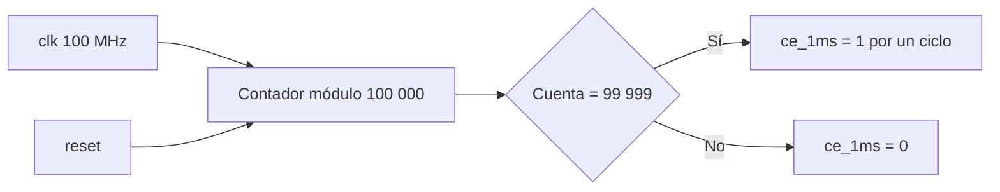

# Generador de habilitación de 1 ms

## Objetivo

Generar un pulso de habilitación de un ciclo de reloj cada milisegundo sin crear
un reloj derivado. Todos los bloques secuenciales continúan utilizando el reloj
principal de 100 MHz.

## Interfaz

| Señal | Dirección | Ancho | Descripción |
|---|---:|---:|---|
| `clk` | entrada | 1 | Reloj principal de 100 MHz |
| `reset` | entrada | 1 | Reinicio síncrono activo en alto |
| `ce_1ms` | salida | 1 | Pulso de un ciclo cada 1 ms |

## Cálculo

Para un reloj de 100 MHz:

```text
CYCLES_PER_MS = 100 000 000 / 1000 = 100 000 ciclos
```

El contador recorre de 0 a 99 999. Al alcanzar el valor final vuelve a cero y
activa `ce_1ms` durante exactamente un ciclo del reloj principal.

## Diagrama de bloques



## Tabla de comportamiento

| Condición | Próximo contador | `ce_1ms` |
|---|---:|---:|
| `reset = 1` | 0 | 0 |
| contador menor que el máximo | contador + 1 | 0 |
| contador igual al máximo | 0 | 1 |

## Decisiones de diseño

- Se utiliza un *clock enable* y no un reloj dividido.
- La frecuencia es parametrizable para acelerar los testbenches.
- El pulso está registrado y dura exactamente un ciclo.
- No se infieren latches porque toda la lógica de estado está en `always_ff`.

## Verificación

El testbench `tb_ce_1ms_generator.sv` utiliza una frecuencia reducida para
comprobar automáticamente:

1. ausencia de pulsos durante reset;
2. separación exacta entre pulsos;
3. duración de un solo ciclo;
4. reinicio del contador y de la salida.

Un fallo provoca `$error` y el test termina con `$fatal`.
