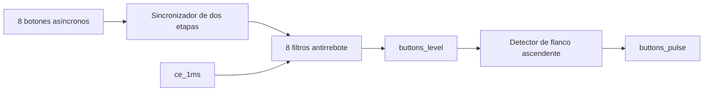

# Acondicionamiento de los ocho botones externos

## Objetivo

Convertir ocho entradas asíncronas provenientes de pulsadores mecánicos en
niveles estables y pulsos de un ciclo utilizables por la FSM del juego.

## Arquitectura



El subsistema se divide en:

1. `sync_2ff.sv`: reduce el riesgo de metastabilidad;
2. `button_debouncer.sv`: exige estabilidad durante un número parametrizable
   de milisegundos;
3. `button_bank.sv`: instancia los ocho filtros y genera pulsos de flanco.

## Interfaz de `button_bank`

| Señal | Dirección | Ancho | Descripción |
|---|---:|---:|---|
| `clk` | entrada | 1 | Reloj principal de 100 MHz |
| `reset` | entrada | 1 | Reinicio síncrono |
| `ce_1ms` | entrada | 1 | Habilitación temporal compartida |
| `buttons_async` | entrada | 8 | Pulsadores externos sin acondicionar |
| `buttons_level` | salida | 8 | Estado estable de cada pulsador |
| `buttons_pulse` | salida | 8 | Pulso de un ciclo por cada presión válida |

## Comportamiento del antirrebote

| Entrada sincronizada | Nivel actual | Acción |
|---:|---:|---|
| igual | cualquiera | reiniciar contador de estabilidad |
| diferente por menos de `DEBOUNCE_MS` | cualquiera | conservar nivel actual |
| diferente durante `DEBOUNCE_MS` | cualquiera | aceptar nuevo nivel |

Para hardware se utilizarán 10 ms. Este valor es suficientemente grande para
rechazar rebotes típicos y suficientemente pequeño para no afectar la
jugabilidad.

## Detector de flanco

```text
buttons_pulse = buttons_level AND NOT(previous_level)
```

Por ello, mantener presionado un botón no genera múltiples golpes.

## Verificación

`tb_button_bank.sv` reduce el intervalo de antirrebote a tres muestras y
comprueba automáticamente:

- reset;
- rechazo de rebotes cortos;
- aceptación de una pulsación estable;
- pulso de exactamente un ciclo;
- ausencia de repetición al mantener el botón;
- liberación filtrada;
- pulsación simultánea de dos botones.

Cada resultado se reporta mediante `PASS`; cualquier diferencia utiliza
`$error` y finaliza con `$fatal`.
