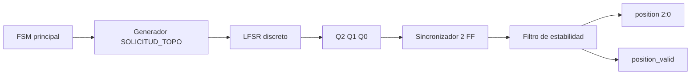

# Enlace paralelo y solicitud de topo

## Objetivo

Sustituir el enlace UART por una interfaz paralela de tres bits, manteniendo la
separación entre los dominios temporales del circuito discreto y la FPGA.

## Arquitectura

## Receptor paralelo

`parallel_position_receiver.sv` sincroniza los tres bits, exige que el vector
permanezca estable durante `STABLE_MS` muestras y genera `position_valid`
durante un ciclo cuando acepta una posición nueva.

| Condición | Acción |
|---|---|
| vector cambia | guardar candidato y reiniciar estabilidad |
| candidato aún no cumple el tiempo | conservar posición anterior |
| candidato estable | actualizar posición y pulsar `position_valid` |
| candidato igual a posición aceptada | no repetir `position_valid` |

El filtro vectorial evita aceptar códigos transitorios causados por diferencias
de propagación entre Q0, Q1 y Q2.

## Generador de solicitud

`mole_request_generator.sv` convierte `start` en un pulso de duración
parametrizable hacia el circuito discreto.

| Estado | `solicitud_topo` | `busy` | Acción |
|---|---:|---:|---|
| reposo | 0 | 0 | aceptar `start` |
| transmitiendo solicitud | 1 | 1 | contar pulsos `ce_1ms` |
| finalización | 0 | 0 | pulsar `done` un ciclo |

Solicitudes adicionales durante `busy` se ignoran para garantizar un solo
avance del LFSR.

## Verificación

`tb_parallel_position_receiver.sv` comprueba reset, estabilidad mínima,
rechazo de transitorios, pulso `position_valid` y ausencia de validaciones
duplicadas.

`tb_mole_request_generator.sv` comprueba duración exacta, señal `busy`, rechazo
de nuevos inicios, ancho de `done` y cancelación mediante reset.
