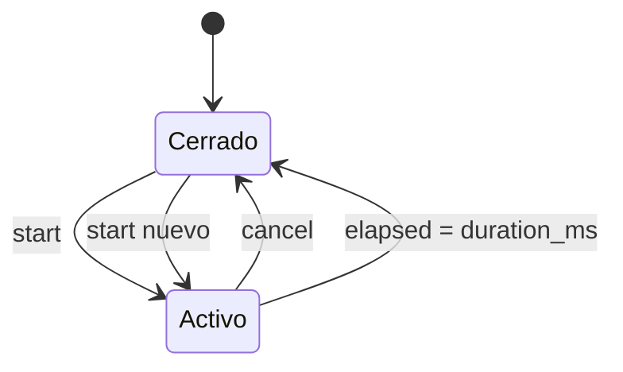

# Evaluador de golpe y temporizador del turno

## Evaluador de golpe

`game_hit_evaluator.sv` convierte la posición binaria en un vector one-hot y
clasifica el vector de pulsos de botones.

```text
active_mole_onehot = 1 << active_position
```

## Tabla de decisión

| Ventana | Botones | Comparación | Acierto | Fallo |
|---:|---:|---|---:|---:|
| 0 | cualquiera | cualquiera | 0 | 0 |
| 1 | ninguno | - | 0 | 0 |
| 1 | exactamente el topo | igual | 1 | 0 |
| 1 | botón incorrecto | diferente | 0 | 1 |
| 1 | varios botones | diferente | 0 | 1 |

El módulo es combinacional. Los pulsos provienen de `button_bank`, por lo que
un botón sostenido no provoca múltiples evaluaciones.

## Temporizador del turno

`turn_window_timer.sv` cuenta habilitaciones `ce_1ms` mientras la ventana está
activa.



`cancel` tiene prioridad sobre `start`. Esto garantiza que una pulsación ya
evaluada cierre la ventana sin producir posteriormente un fallo por timeout.

## Interfaz del temporizador

| Señal | Dirección | Descripción |
|---|---:|---|
| `clk` | entrada | Reloj principal |
| `reset` | entrada | Reinicio síncrono |
| `ce_1ms` | entrada | Habilitación temporal |
| `start` | entrada | Abre o reinicia la ventana |
| `cancel` | entrada | Cierra sin timeout |
| `duration_ms` | entrada | Duración programada en milisegundos |
| `active` | salida | Ventana abierta |
| `timeout_pulse` | salida | Pulso de un ciclo al expirar |

## Verificación

`tb_game_hit_evaluator.sv` recorre las ocho posiciones y verifica aciertos,
fallos, ventana cerrada, ausencia de golpe y pulsaciones múltiples.

`tb_turn_window_timer.sv` verifica ventanas de 5 ms, 3 ms y 1 ms, ancho de
timeout, cancelación anticipada y reinicio posterior.
