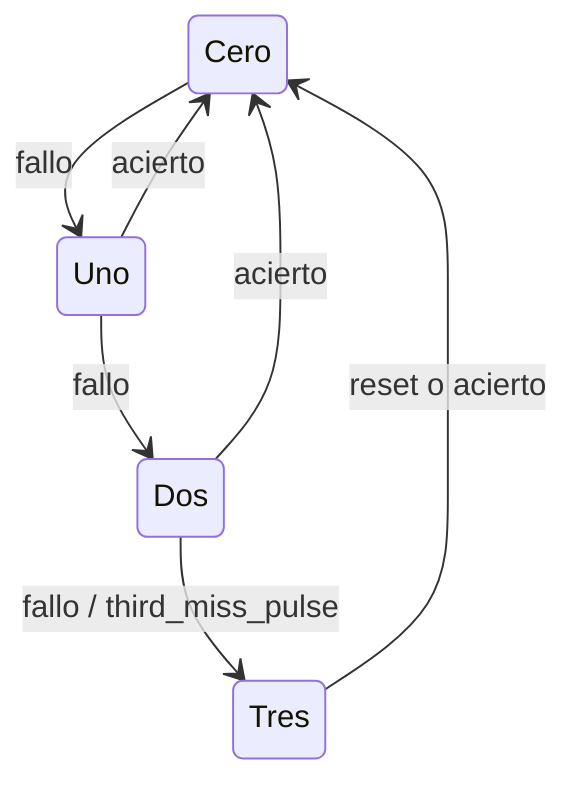

# Dificultad, puntajes y fallos consecutivos

## Control de dificultad

`difficulty_controller.sv` almacena la duración actual del turno. El registro
se inicializa en 1500 ms, disminuye 100 ms por acierto y se limita a 500 ms.
Los fallos no restauran la dificultad.

| Aciertos que reducen dificultad | Duración (ms) |
|---:|---:|
| 0 | 1500 |
| 1 | 1400 |
| 2 | 1300 |
| 3 | 1200 |
| 4 | 1100 |
| 5 | 1000 |
| 6 | 900 |
| 7 | 800 |
| 8 | 700 |
| 9 | 600 |
| 10 o más | 500 |

## Contadores acumulados

`score_counters.sv` contiene registros independientes de siete bits para
aciertos y fallos. Ambos saturan en 99 y vuelven a cero únicamente con reset de
partida.

| Evento | Aciertos | Fallos |
|---|---|---|
| `hit_pulse` | +1 hasta 99 | sin cambio |
| `miss_pulse` | sin cambio | +1 hasta 99 |
| `reset` | 0 | 0 |

## Fallos consecutivos

`consecutive_misses.sv` implementa las tres oportunidades del jugador.

El contador acumulado de fallos es independiente de este bloque. Un acierto
reinicia los fallos consecutivos, pero no modifica el total mostrado.

## Verificación

- `tb_difficulty_controller.sv`: comprueba toda la tabla, mínimo, fallo y reset.
- `tb_score_counters.sv`: comprueba conteo independiente, saturación y reset.
- `tb_consecutive_misses.sv`: comprueba tercer fallo, ancho del pulso,
  saturación y reinicio mediante acierto.
