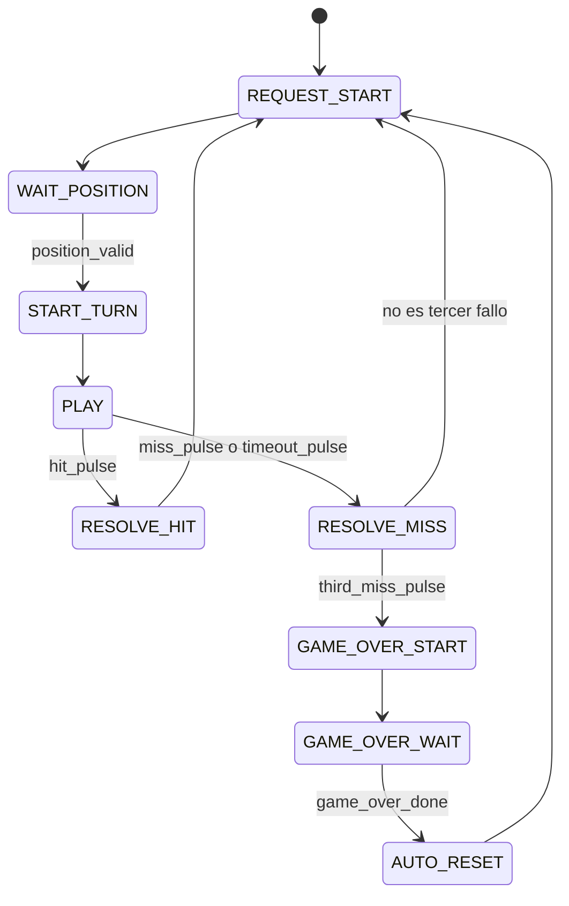

# Temporizador de fin de partida y FSM principal

## Temporizador de fin de partida

`game_over_timer.sv` mantiene el estado de fin de partida durante 2000 ms. El
tiempo se mide mediante `ce_1ms`, sin generar relojes derivados.

| Evento | `active` | `done_pulse` |
|---|---:|---:|
| reset | 0 | 0 |
| start | 1 | 0 |
| antes de 2000 ms | 1 | 0 |
| al completar 2000 ms | 0 | 1 por un ciclo |

## Máquina de estados principal

`game_controller_fsm.sv` implementa el control path del juego.

## Salidas de control

| Estado | Salida principal |
|---|---|
| `REQUEST_START` | `request_start` |
| `START_TURN` | `turn_start` |
| `RESOLVE_HIT/MISS` | `turn_cancel` |
| `GAME_OVER_START` | `game_over_start`, `game_over` |
| `GAME_OVER_WAIT` | `game_over` |
| `AUTO_RESET` | `game_data_reset` |

La FSM es de tipo Moore: las salidas dependen del estado registrado. Esto hace
que los pulsos de control tengan un ciclo completo y facilita su verificación.

## Reinicios

- El reset manual lleva inmediatamente a `REQUEST_START`.
- El tercer fallo inicia el temporizador de fin de partida.
- Después de 2 segundos, `AUTO_RESET` limpia puntajes, dificultad y fallos
  consecutivos antes de solicitar una nueva posición.

## Verificación

`tb_game_over_timer.sv` comprueba duración, ancho de `done_pulse` y reset.

`tb_game_controller_fsm.sv` recorre los caminos de acierto, fallo, timeout,
tercer fallo, game over, reinicio automático y reset manual.
