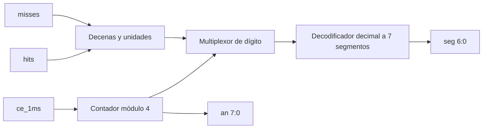

# Displays de puntaje e indicador de estado

## Controlador de siete segmentos

`seven_segment_controller.sv` muestra cuatro dígitos con el formato `MMHH`:

```text
AN3  AN2  AN1  AN0
 M10  M1   H10  H1
```

- `H`: aciertos acumulados.
- `M`: fallos acumulados.
- AN4 a AN7 permanecen deshabilitados.
- Los ceros iniciales se muestran para mantener el formato `00` a `99`.

## Multiplexado

El índice de barrido avanza cada vez que se activa `ce_1ms`. Cada dígito se
refresca cada 4 ms, equivalente a 250 Hz por dígito.



Los segmentos y ánodos de la Nexys 4 son activos en bajo.

## Indicador de estado

`status_indicator.sv` utiliza un LED separado:

| Estado | Comportamiento del LED |
|---|---|
| partida activa | encendido fijo |
| fin de partida | parpadeo cada 250 ms |
| estado inactivo/reset | apagado |

El parpadeo utiliza `ce_1ms` y no genera un reloj adicional.

## Verificación

`tb_seven_segment_controller.sv` comprueba el barrido completo con aciertos 42
y fallos 17, además de los casos 00 y 99.

`tb_status_indicator.sv` comprueba reset, partida activa, dos fases de
parpadeo, retorno a partida y estado inactivo.
